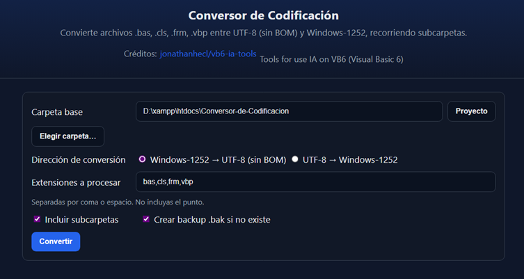

# Conversor de Codificación (UTF-8 ↔ Windows-1252)



## Guía rápida de uso

Sigue estos pasos para utilizar el conversor de forma sencilla.

### Requisitos

- Windows con XAMPP (Apache) para la versión web en PHP.
- PowerShell 5.1 o superior para los scripts `.ps1` (opcional).

### Instalación (XAMPP)

1. Copia esta carpeta dentro de `htdocs`, por ejemplo:
   - `d:/xampp/htdocs/Conversor-de-Codificacion`
2. En XAMPP, inicia Apache.
3. Abre en el navegador:
   - `http://localhost/Conversor-de-Codificacion/index.php`

### Uso rápido (versión web en PHP)

1. En “Carpeta base”, escribe la ruta a la carpeta que quieres procesar (ej.: `D:\proyectos\MiJuegoVB6`).
   - Botón “Proyecto”: pone la carpeta del proyecto actual.
   - Botón “Elegir carpeta…”: abre un explorador para navegar por subcarpetas.
2. Elige la “Dirección de conversión”:
   - Windows-1252 → UTF-8 (sin BOM)
   - UTF-8 → Windows-1252
   - Arreglar mojibake (reparación heurística y guardar en Windows-1252)
   - Restaurar desde .bak (si existe una copia de seguridad)
3. “Extensiones a procesar”: por defecto `bas, cls, frm, vbp`.
4. Opciones:
   - “Incluir subcarpetas”: busca dentro de todas las carpetas.
   - “Crear backup .bak si no existe”: guarda una copia del archivo antes de convertir.
5. Pulsa “Convertir”. Verás un resumen con procesados, convertidos y errores.

Recomendación: comienza con una carpeta pequeña o realiza una copia de seguridad antes de convertir proyectos grandes.

### Uso con PowerShell (alternativa por consola)

Abre PowerShell en la carpeta del proyecto y ejecuta:

Convertir a UTF-8 (sin BOM):

```powershell
./script/ConvertTo-Utf8.ps1 -Path "C:\ruta\a\mi\proyecto"
```

Convertir a Windows-1252:

```powershell
./script/ConvertTo-Win1252.ps1 -Path "C:\ruta\a\mi\proyecto"
```

Si PowerShell bloquea los scripts, puedes ajustar temporalmente la Execution Policy (como administrador):

```powershell
Set-ExecutionPolicy -Scope Process -ExecutionPolicy Bypass
```

### Notas de seguridad

- Esta herramienta está pensada para uso local en tu máquina.
- No conviertas carpetas del sistema ni rutas ajenas a tu proyecto.
- Activa la opción de backup `.bak` para poder deshacer si algo no queda como esperabas.
- Salvaguardas para VB6:
  - Los archivos `*.frm` y `*.vbp` NO se convierten a UTF-8 por seguridad: deben permanecer en Windows-1252.
  - Para cualquier archivo VB6 (`.bas`, `.cls`, `.frm`, `.vbp`) el guardado fuerza finales de línea CRLF (Windows) para evitar corrupción en el IDE.
  - Recomendación: si un `.frm` se ve corrupto, usa “Arreglar mojibake” o “Restaurar desde .bak”.

### Problemas comunes y soluciones

- “No se encontraron archivos para convertir”:
  - Revisa la ruta de “Carpeta base” y las extensiones.
- “Errores de escritura o permisos”:
  - Ejecuta XAMPP/Apache con permisos suficientes o elige una carpeta donde tengas lectura/escritura.
- “Caracteres raros tras convertir a Windows-1252”:
  - Algunos caracteres de UTF-8 no existen en Windows-1252 y se sustituyen/ignoran.
  - Revisa el resultado y considera quedarte en UTF-8 si es posible.

Tools for use IA on VB6 (Visual Basic 6)

## Créditos

Este proyecto agradece y reconoce la inspiración y herramientas del repositorio:

- [jonathanhecl/vb6-ia-tools](https://github.com/jonathanhecl/vb6-ia-tools)

## Scripts de conversión

### Versión PowerShell (Windows)

- `script/ConvertTo-Utf8.ps1` - Convierte archivos de Windows-1252 a UTF-8
- `script/ConvertTo-Win1252.ps1` - Convierte archivos de UTF-8 a Windows-1252

### Versión PHP (XAMPP/Apache)

- `utilidades/convert-encoding.php` - Interfaz web para:
  - Convertir archivos entre Windows-1252 y UTF-8 (sin BOM) recorriendo subcarpetas.
  - Arreglar mojibake: intenta revertir corrupción típica (Ã, Â, …) en 1–2 pasadas y guarda en Windows-1252 (útil para proyectos VB6).

## Uso de la versión PHP

1. Inicia Apache en XAMPP.
2. Abre en el navegador:
   - `http://localhost/Conversor-de-Codificacion/index.php`
3. En el formulario:
   - Indica la carpeta base a procesar.
   - Elige la dirección de conversión: Windows-1252 → UTF-8, UTF-8 → Windows-1252 o **Arreglar mojibake**.
   - Define extensiones (por defecto: `bas, cls, frm, vbp`).
   - Marca si quieres incluir subcarpetas y crear backups `.bak` (opcional).
4. Pulsa "Convertir" para ejecutar.

## Recursos estáticos

- CSS: `css/convert-encoding.css`
- JS: `js/convert-encoding.js`

## Uso de los scripts de PowerShell

### Convertir a UTF-8

```powershell
.\script\ConvertTo-Utf8.ps1 [-Path "ruta\al\directorio"]
```

### Convertir a Windows-1252

```powershell
.\script\ConvertTo-Win1252.ps1 [-Path "ruta\al\directorio"]
```

### Ejemplos

1. Convertir archivos en el directorio actual:

   ```powershell
   .\script\ConvertTo-Utf8.ps1
   ```

2. Convertir archivos en un directorio específico:

   ```powershell
   .\script\ConvertTo-Utf8.ps1 -Path "C:\ruta\a\mi\proyecto"
   ```

## Características

- Procesa archivos .bas, .cls, .frm y .vbp de forma recursiva
- Muestra un resumen de la conversión
- Manejo de errores detallado
- Compatible con PowerShell 5.1 y versiones posteriores
- Salvaguardas para VB6: evita UTF-8 en `.frm`/`.vbp` y normaliza CRLF al guardar archivos VB6

## Notas

- Los scripts de PowerShell están diseñados para Windows.
- Los scripts de bash requieren `iconv` instalado.

## Agradecimientos

Este proyecto agradece e inspira su trabajo en el repositorio:

- [jonathanhecl/vb6-ia-tools](https://github.com/jonathanhecl/vb6-ia-tools): Tools for use IA on VB6 (Visual Basic 6)
